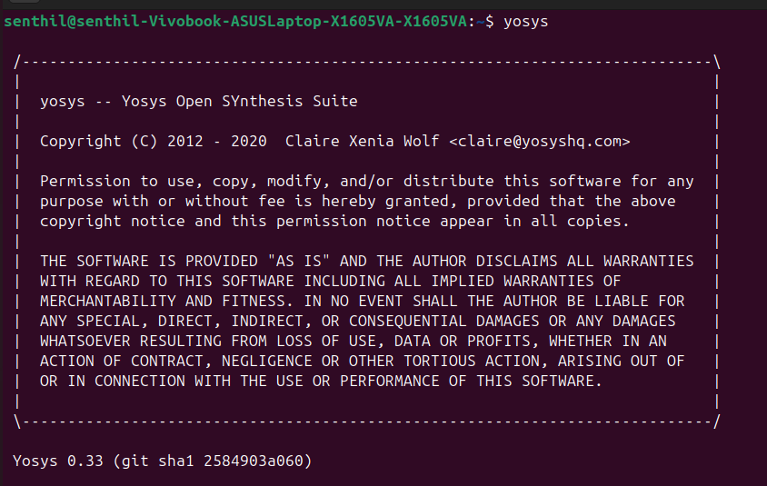
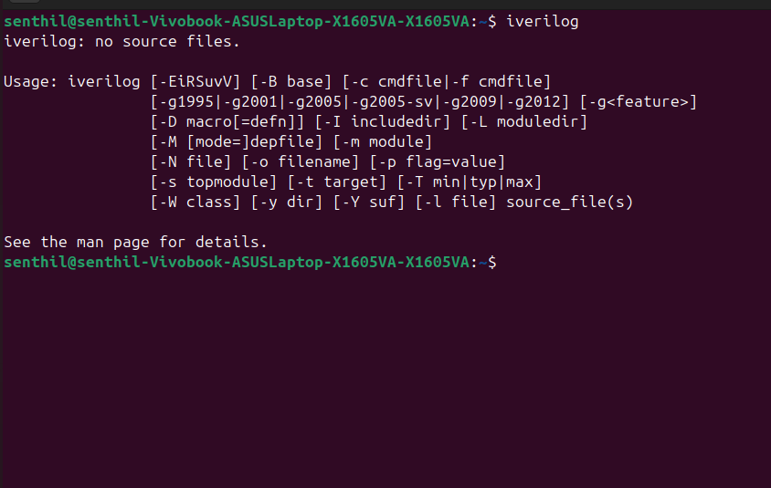
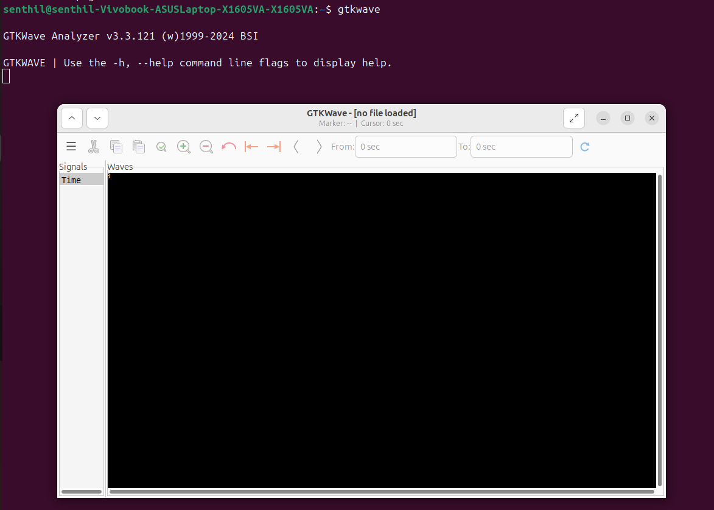
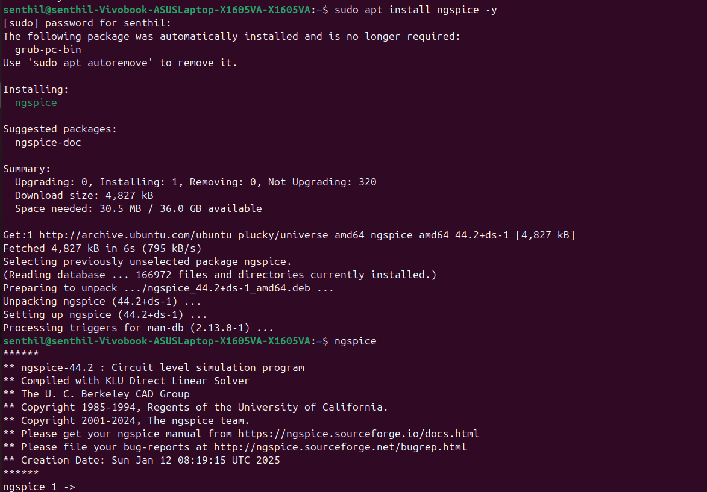
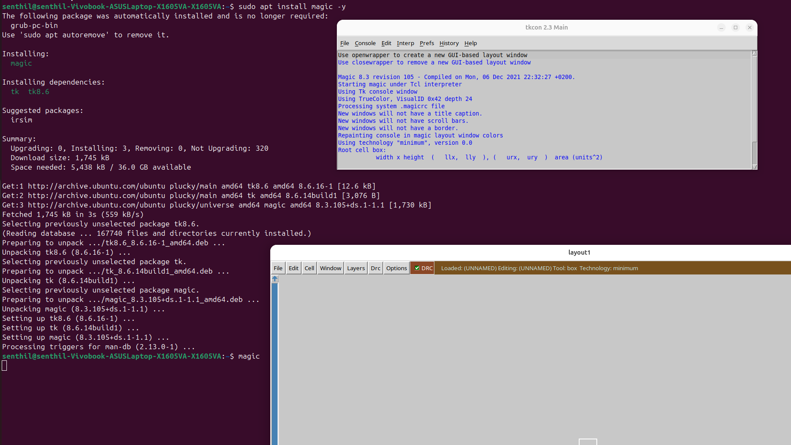

# 🛠️ Tool Installation Guide

Welcome! This colorful guide will help you install and verify the essential tools needed for your RISC-V SoC tapeout journey.  
**Each tool section includes:**  
- ✨ Installation command  
- 📸 Verification screenshot  

---

<section>
<h2>1. 🛤️ Yosys (Open SYnthesis Suite)</h2>

**Install Command:**
```bash
sudo apt update
sudo apt install yosys -y
```

**Verify Installation:**  
After installing, run:
```bash
yosys
```
You should see output as below:



</section>

---

<section>
<h2>2. ⚙️ Icarus Verilog (iverilog)</h2>

**Install Command:**
```bash
sudo apt install iverilog -y
```

**Verify Installation:**  
After installing, run:
```bash
iverilog
```
You should see output as below:



</section>

---

<section>
<h2>3. 🌊 GTKWave</h2>

**Install Command:**
```bash
sudo apt install gtkwave -y
```

**Verify Installation:**  
After installing, run:
```bash
gtkwave
```
You should see the GTKWave GUI as below:



</section>

---

<section>
<h2>4. ⚡ Ngspice</h2>

**Install Command:**
```bash
sudo apt install ngspice -y
```

**Verify Installation:**  
After installing, run:
```bash
ngspice
```
You should see output as below:



</section>

---

<section>
<h2>5. 🧙 Magic VLSI</h2>

**Install Command:**
```bash
sudo apt install magic -y
```

**Verify Installation:**  
After installing, run:
```bash
magic
```
You should see the Magic VLSI GUI as shown below:



</section>

---

## 🌟 Summary

✅ Make sure each tool launches and displays output similar to the screenshots above.  
🌱 These open-source tools are essential for digital and analog design, simulation, synthesis, and layout in your RISC-V SoC projects.  
🎨 **Enjoy your colorful journey into VLSI design!**

---
